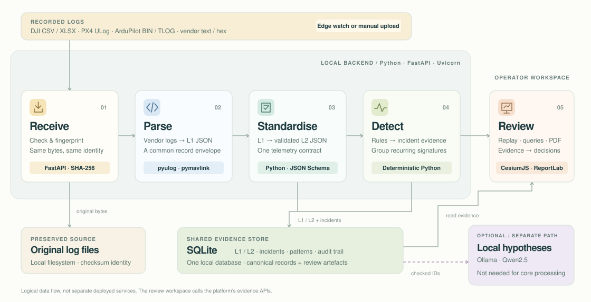

# WISL architecture

Post-flight evidence pipeline for mixed UAS fleets. One sentence: **raw recorded logs go in, checksum-addressed evidence comes out** — a canonical telemetry series, deterministic incident observations, a 3D replay, evidence-backed answers, and reviewable bulletins.

Everything numeric is rule-based and reproducible. The optional local model only drafts hypotheses against evidence IDs that already exist.

## Interactive backend architecture

**[Open the interactive backend architecture](architecture.html)** — click a stage for its overview, implementation, and trade-offs. Use **Walk through the flow** to follow the five processing stages, or **Full screen** for a focused view. The package and decision details below are embedded in the page, along with the original component and sequence diagrams.

On GitHub, the static preview below renders directly. To use the interactive version, download `architecture.html` and open it in a browser; GitHub's file viewer shows HTML source. The HTML is self-contained and works offline, without a review sidebar, server, or external libraries.

### The five-stage data flow

1. **Receive · FastAPI + SHA-256** — accept the log, check it, and reuse the same record for identical bytes.
2. **Parse · Python, pyulog, pymavlink** — decode vendor logs into a common L1 JSON envelope.
3. **Standardise · Python + JSON Schema** — project L1 into validated L2 telemetry that every downstream feature understands.
4. **Detect · deterministic Python rules** — turn telemetry into timestamped incident evidence and recurring patterns.
5. **Review · CesiumJS, vanilla JavaScript, ReportLab** — replay, query, and report on the same stored evidence.

**Underneath:** SQLite stores the records and evidence; the local filesystem preserves original logs. **Alongside:** optional Ollama / Qwen2.5 analysis drafts hypotheses, not telemetry or rule detections.

### Maintaining the diagram

Edit the layout, stage summaries, and interactions in [`architecture.html`](architecture.html). The tables in the engineering reference below remain the source for the **Implementation** and **Trade-offs** tabs. Run `python3 docs/diagrams/render.py --html-only` to refresh their embedded data, the reference images, and the GitHub SVG preview. Omit `--html-only` to also rebuild and validate the Mermaid sequences (requires Node/npm and Chrome).

[Open the detailed architecture atlas](architecture-uml.md) for the editable interface map, upload sequences, data model, and lifecycle.

Full engineering reference · packages, data flow, decisions and limits

Single command: `./sdth-telemetry/scripts/demo-console.sh` starts the API, an in-process background worker (`local_worker.py`), the static console and replay, all on `127.0.0.1:8010`. Redis and Docker are not needed for this path. Parsing, detection and PDF export do not need network access; offline replay depends on the locally available map and terrain assets.

## Packages

| Package | Role | Key files |
|---|---|---|
| `sdth-ingestion pipeline/` | Controller-side edge uploader. Waits for a log file to be size-stable, hashes it, uploads raw bytes with `X-WISL-SHA256`, tracks state in a manifest so nothing is re-sent or lost across restarts. Format-neutral by design — parsing lives server-side. | `src/wisl_ingest/edge/uploader.py`, `destinations.py`, `cli.py` |
| `sdth-telemetry/parsers/` | Format registry. Extension + content sniffing selects a parser; every parser emits the same L1 payload contract (`flight_id`, `event_id`, `source`, `records[]`). Thirteen extensions across DJI CSV/XLSX, PX4 ULog (`pyulog`), ArduPilot `.bin`/`.tlog` (`pymavlink`), Hermes/Orbiter/aunav text skins, vendor hex. | `registry.py`, `dji_csv.py`, `px4_ulg.py`, `ardupilot.py`, `excel.py`, `generic_rows.py` |
| `sdth-telemetry/platform-api/` | FastAPI platform. SQLite storage, canonical L2 projection, detectors, patterns, bulletins, queries, PDF reports, optional model analysis. | `app/*.py`, `migrations/`, `tests/` |
| `sdth-replay/` | CesiumJS 3D replay. Follows recorded time, draws the WGS84 path over cached terrain (Map) or a low-poly tabletop treatment (Tabletop), overlays incident markers. Served locally; no Cesium Ion token. | `public/replay.js`, `tabletop*.mjs`, `src/flight.mjs` |
| `sdth-demo/` | Unified operator console at `/demo/`. Vanilla JS, no build step. Talks only to the documented `/v1` API and embeds the replay via `/replay/?embed=1`. | `demo.js`, `demo-contract.mjs`, `fixtures/` |
| `sdth-synth/` (gitignored, local) | Kinematic scenario-card generator that produced every bundled synthetic log, with a physical-sanity gate and a 50 km geography gate away from real reference homes. Not needed to run the platform; kept out of the repo because of its 3 GB output corpus. | scripts that use it: `sdth-telemetry/scripts/generate_*_fixtures.py` |

## Data flow, stage by stage

Each stage emits a timed log line `upload=<id> stage=<name> … ms=<n>` in the launcher terminal.

1. **received** — `ingest.py`. Extension and size gate, streaming SHA-256 while spooling to disk. A digest already stored returns the existing `upload_id` (`dedup=true`) — the same bytes never produce a second record. Raw bytes are kept untouched under `data/demo-uploads/`.
2. **parsed** — `parsers/registry.parse_raw_log`. Sniffs the format, produces the L1 payload. `flight_id` and `event_id` are derived from the checksum (`stable_identifiers`), so re-ingest is idempotent end to end.
3. **canonical** — `privacy.redact_operator_locations` strips home/operator coordinates and writes an audit row; `canonical_series.persist_canonical_series` projects L1 into the schema-validated **L2** series: `timestamp_utc`, `position{lat,lon,alt_m}`, `attitude{roll_deg,pitch_deg,yaw_deg}`, `battery{percent,voltage_v}`, `sensors`, `metadata{source,frame,...}`. Local-NED-only logs are projected from a reference origin and tagged `frame: local_ned`. Provenance (parser, record count, redactions) is stored on the upload.
4. **detected** — `incidents.index_flight` loads the L2 series and runs `detectors.detect_incidents`. Eight deterministic detectors: `battery_low/critical`, `battery_plunge`, `telemetry_gap`, `attitude_shock`, `gps_jump`, `last_known_position`, `mission_incomplete`, `operator_warning`. Each incident stores the timestamped L2 samples it was derived from (`sample`/`samples` in `evidence_json`, plus position and hazard label) — that is the "evidence" every later view cites. Rule incidents are replaced atomically per flight, then `incident_patterns` is rebuilt across the fleet by signature.
5. **done** — the raw-upload task finishes after enqueueing the follow-up job. `process_job` re-indexes idempotently and then marks the upload `ready`; charts are exported afterward on a best-effort basis. The console polls `GET /v1/uploads/{id}` until `ready` or `failed`.

Downstream evidence views and human-review artefacts:

- **Replay** — `GET /v1/flights/{id}/path` is the stable replay contract (samples + incidents); the viewer never sees raw vendor rows.
- **Record queries** — `POST /v1/demo/query` answers *What happened? / Where is the evidence? / Similar warnings* purely from stored incidents and L2 records. No model involved.
- **Recurring patterns → bulletins** — `GET /v1/incidents/patterns` groups by signature; `POST /v1/mitigation-bulletins` writes a human-review bulletin. Never a vehicle command.
- **Comprehensive PDF** — `pdf_report.py` (ReportLab + matplotlib charts) built entirely from stored evidence; no model call.
- **AI-assisted analysis (optional)** — `demo_api.local_analysis` sends at most 100 flight summaries and 50 incidents to a local Ollama model, then `_validate_model_response` rejects any hypothesis that cites an evidence ID not in the supplied context. Timeouts and invalid output degrade to the deterministic path.

## Storage

SQLite (`data/demo-console.db`), migrations in `platform-api/migrations/`. Tables that matter: `raw_uploads` (file path, sha256, status, provenance) → `ingest_events` (L1, idempotency key) → `canonical_records` (L2) → `incidents` / `incident_patterns` → `mitigation_bulletins`, `comprehensive_reports`; plus `audit_events` and `normalization_provenance`. Everything in `data/` is runtime state and gitignored; a fresh clone starts empty and re-imports the bundled fixtures on Session connect.

## Key technical decisions and trade-offs

| Decision | Why | Trade-off we accepted |
|---|---|---|
| Ship raw bytes, parse server-side | Edge stays tiny and format-neutral; adding a vendor is a parser, not a firmware change; raw evidence is preserved for audit | Bigger uploads than pre-parsed JSON; parsing cost on the platform |
| Checksum-addressed identities | Idempotent re-ingest, global dedup, tamper-evident evidence | Editing a byte creates a "new" flight — by design |
| Deterministic detectors, model optional | Reproducible, explainable, works air-gapped; numbers never come from a model. Early prototype (Jul) used an LLM as the normaliser and we replaced it after seeing invented values | Thresholds are hand-tuned for the demo envelope; no learned anomaly detection |
| L2 canonical schema between parsers and detectors | Detectors are written once for nine formats; schema validation catches parser drift (it caught the DJI 0.0 m altitude bug) | Some vendor-specific fields only survive in `sensors`/`metadata` |
| SQLite + in-process worker | One command, one file, no Redis/Docker for the local demo; the Redis/Compose path still exists for the two-laptop setup | Serialised processing of large exports |
| CesiumJS served locally with cached terrain/tiles | Replay can use locally available cached terrain/tiles; no Ion token | Uploads outside cached regions show a flat globe (`Terrain uncached`) rather than invented terrain |
| Synthetic corpus from a kinematic generator with gates | We lacked rights to a large real failure corpus; scenario cards give ground truth for expected detector outcomes | Synthetic ≠ operational; every fixture is labelled as such, and real public logs were used for a false-positive audit |

## Tests and evidence

- `platform-api`: `pytest -q` (197 tests: API, detectors, canonical projection, PDF, privacy, patterns).
- `parsers/tests`: 30 tests across formats.
- `sdth-replay/tests`, `sdth-demo/test`: `node --test`.
- `output/evidence/`: measured upload timings, corpus validation, stage-log samples, false-positive audit on real logs.
- `docs/submission/corpus-validation.md`: denominators, provenance, limitations.

## Operating envelope and known limits

- Post-flight only. No live GCS link, no onboard inference, no automated fleet actions.
- Detector thresholds are demonstration values; they are documented in `sdth-telemetry/README.md` and adjustable in `detectors.py`.
- Formats outside the thirteen registered extensions are rejected at `received`, with the reason.
- Bundled terrain covers the demo regions; outside cached terrain, replay falls back to a flat globe. Uncached raster imagery needs network access.
- Model analysis uses Ollama or a supported local OpenAI-compatible server; without it all deterministic features still work.

