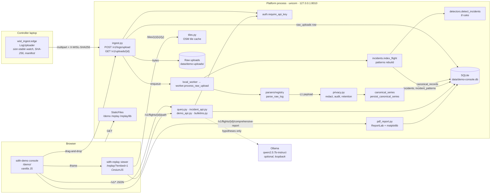
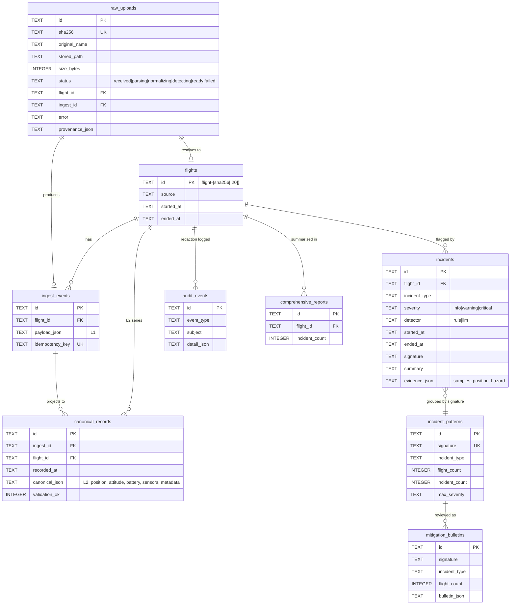
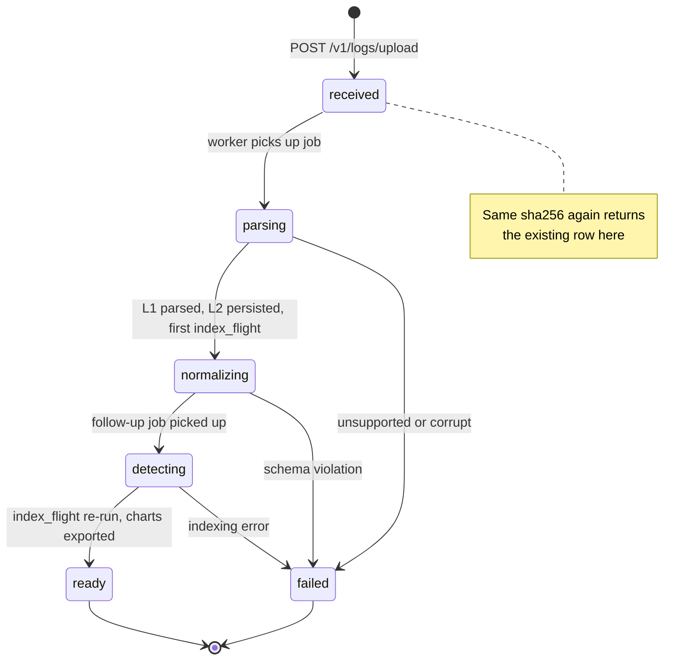

# WISL architecture, UML

Three views. GitHub renders the Mermaid blocks; locally, any Markdown preview with Mermaid support will too. Column and file names match the code as of 24 Sep.

## 1. Component diagram

Who talks to whom, and over what.



## 2. Sequence diagram: one upload

What happens between dropping a file and "Ready to review". The `stage=` labels are the log lines printed in the launcher terminal.

```mermaid
sequenceDiagram
    autonumber
    actor Op as Operator / judge
    participant UI as Console (demo.js)
    participant API as ingest.py
    participant Q as local_worker
    participant W as worker.process_raw_upload
    participant P as parsers.registry
    participant C as canonical_series
    participant I as incidents.index_flight
    participant D as detectors
    participant DB as SQLite

    Op->>UI: drop file on Import log
    UI->>API: POST /v1/logs/upload (multipart, X-API-Key)
    API->>API: extension + size gate, stream SHA-256 to disk
    API->>DB: SELECT raw_uploads WHERE sha256 = ?
    alt digest already stored
        DB-->>API: existing row
        API-->>UI: 200 {upload_id: existing, status}
        Note over API: stage=received dedup=true
    else new digest
        API->>DB: INSERT raw_uploads (status=received)
        API->>Q: enqueue(upload_id)
        API-->>UI: 200 {upload_id, status: received}
        Note over API: stage=received dedup=false
        Q->>W: process_raw_upload(upload_id)
        W->>DB: UPDATE status=parsing
        W->>P: parse_raw_log(path, sha256, name)
        P-->>W: L1 payload, parser_key
        Note over W: stage=parsed records=N ms=…
        W->>W: privacy.redact_operator_locations
        W->>DB: INSERT flights, ingest_events (idempotency_key)
        W->>C: persist_canonical_series(L1)
        C->>DB: INSERT canonical_records (L2, validated)
        W->>DB: UPDATE raw_uploads provenance, status=normalizing
        Note over W: stage=canonical redactions=n ms=…
        W->>I: index_flight(flight_id)
        I->>DB: load L2 series
        I->>D: detect_incidents(series)
        D-->>I: [Incident]
        I->>DB: DELETE rule incidents; INSERT incidents; rebuild incident_patterns
        Note over W: stage=detected incidents=k types=…
        W->>Q: enqueue_translation_job(job_id)
        Note over W: stage=done total_ms=…
        Q->>W: process_translation_job(job_id)
        W->>DB: UPDATE status=detecting
        W->>I: index_flight(flight_id) (idempotent re-run)
        W->>DB: UPDATE status=ready
        W->>W: chart_export.export_charts_for_flight
    end
    loop until ready
        UI->>API: GET /v1/uploads/{id}
        API-->>UI: {status}
    end
    UI->>API: GET /v1/flights/{id}, /incidents, /path
    UI-->>Op: Ready to review
```

## 3. Data model

The tables the demo actually touches. JSON columns hold the parts of the schema that vary by vendor.



## 4. Upload state machine

The `status` column on `raw_uploads`, which is what the console polls.



Related reading: [`ARCHITECTURE.md`](ARCHITECTURE.md) for the prose and trade-offs, `sdth-telemetry/openapi/openapi.yaml` for the full API contract.
