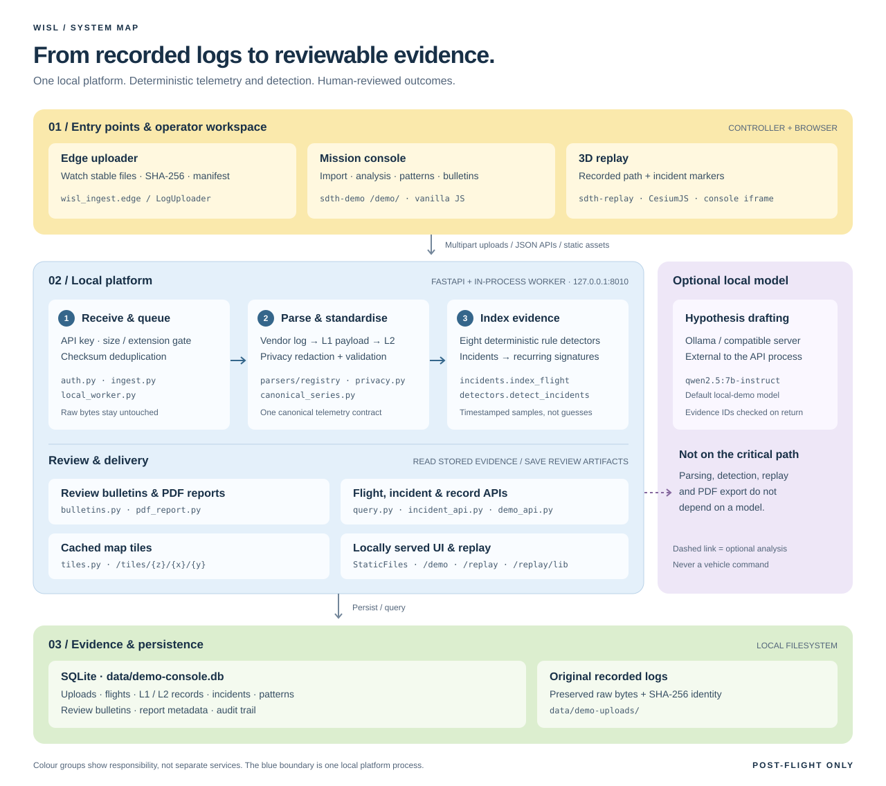
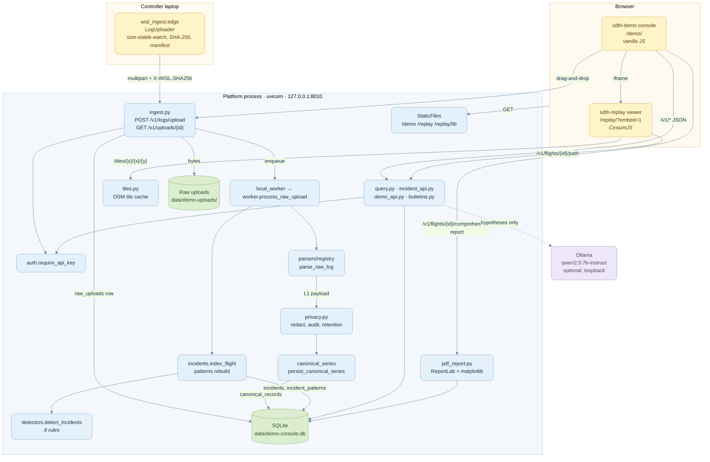
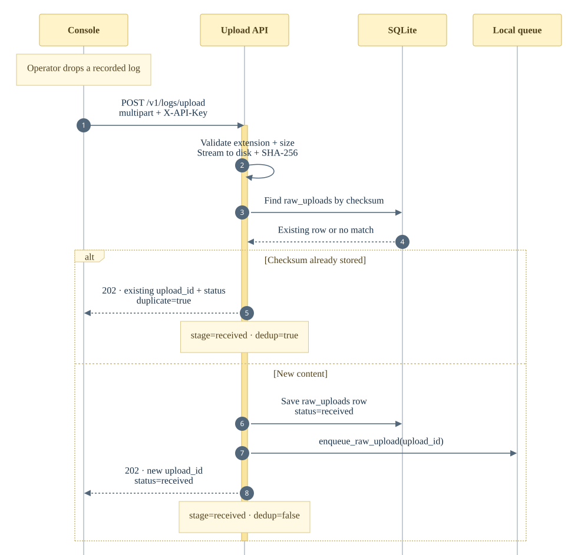
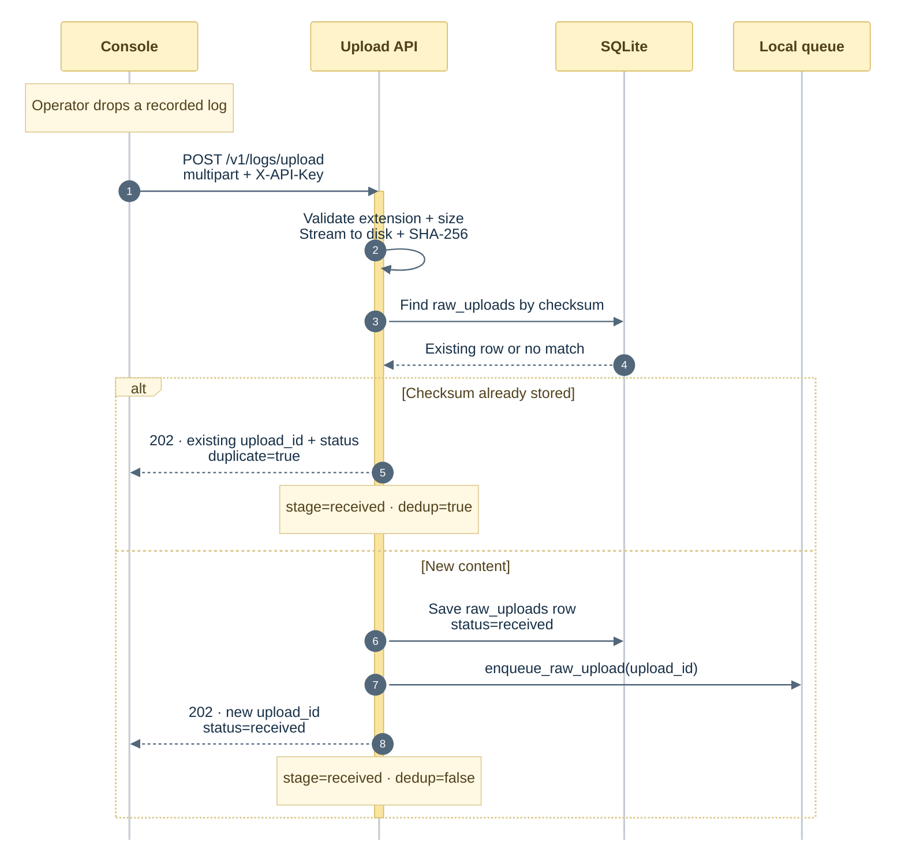
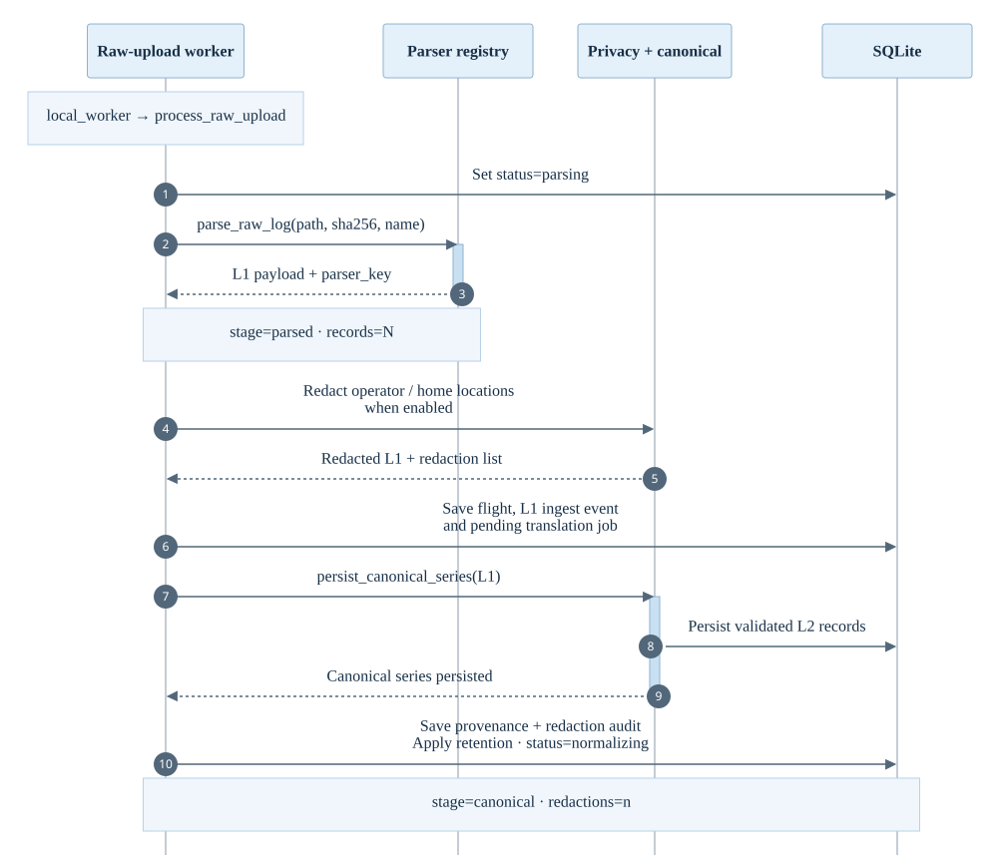
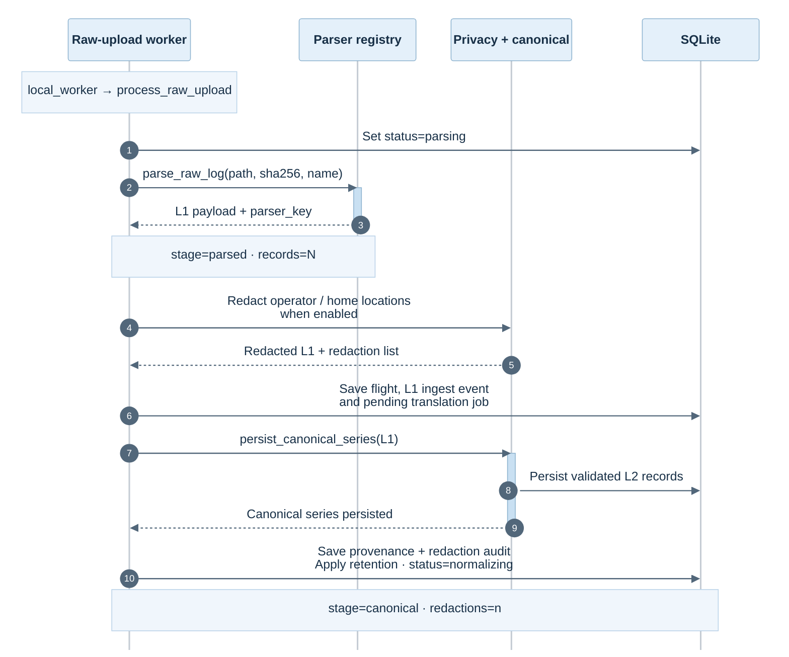
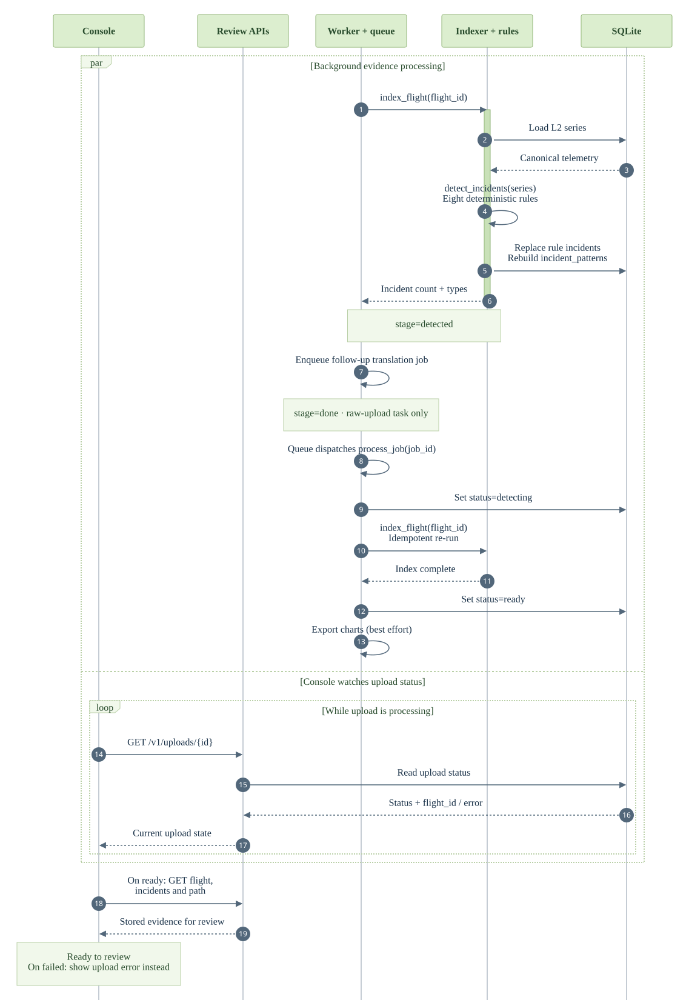
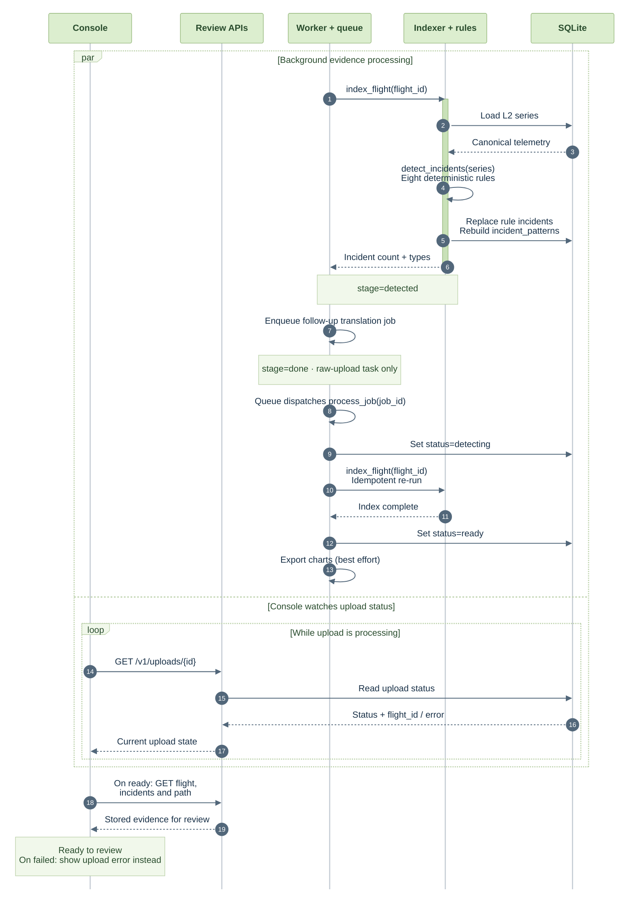
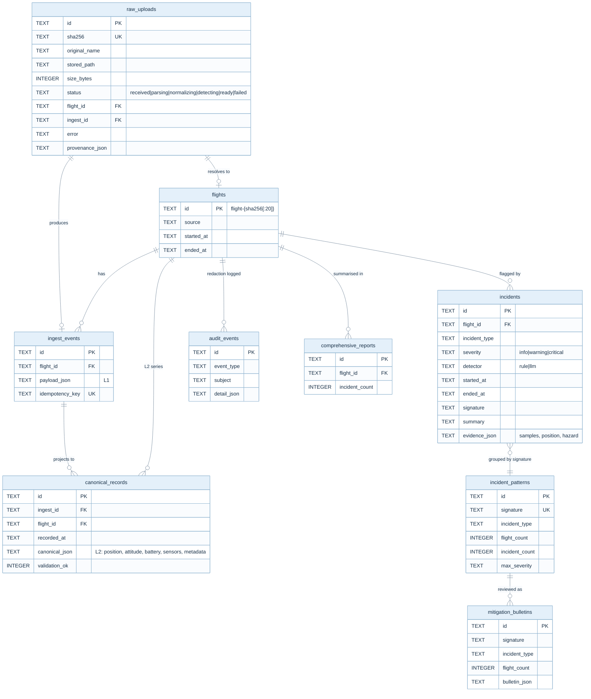
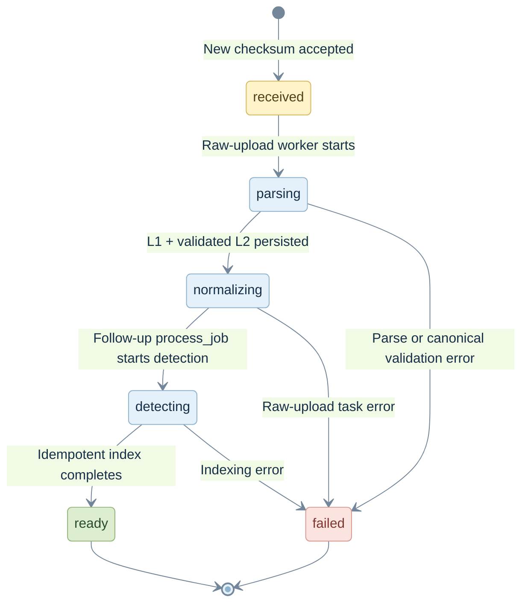

# WISL architecture atlas

**Recorded logs → canonical telemetry → reviewable evidence.**

Four views of the local demo: a layered component map, a three-part upload sequence, the data model, and the upload lifecycle. The component and sequence views are SVGs, so they display without a Mermaid plugin and stay sharp when enlarged. Expand the source sections for the detailed interface map and editable sequence definitions.

**Viewing on GitHub:** the diagrams below render directly in this page. For the standalone HTML layout, download [`architecture.html`](architecture.html) and open it in a browser. It includes an interactive backend data-flow diagram with click-to-explore details and all four reference diagrams. Its inline JavaScript works offline, without external dependencies or review-tool UI; GitHub's file viewer shows HTML source rather than running the page.

## 1. Component map

Read from top to bottom: **amber** entry points, **blue** platform processing and review, **green** persistence. The **purple** model is optional and outside the platform process. Numbered processing steps show order; the surrounding groups show responsibility, not independently deployed services.

[Open the full-size component map](diagrams/components.svg). The layered map is editable directly as SVG; the detailed connection view below is Mermaid.

Detailed interface map · API routes, modules and connections

## 2. Upload journey

One upload, shown in three acts instead of ten simultaneous lifelines. **Amber** is receipt, **blue** is canonical processing, and **green** is evidence and review. Solid arrows are calls; dashed arrows are responses. The `stage=` notes are launcher log events, not upload statuses.

### A. Receive & acknowledge

The operator drops a file in the console. The API authenticates, checks the upload, and looks up its checksum. An existing digest reuses its upload record; only new content enters the worker queue.

Editable Mermaid source · receive & acknowledge

### B. Turn raw bytes into canonical evidence

The local worker dispatches `process_raw_upload`. Parsing returns L1; privacy handling and canonical projection produce the validated L2 series. The diagram groups privacy and canonical code in one lifeline to keep the flow readable.

Editable Mermaid source · canonical processing

### C. Detect, finalise & review

The indexer runs deterministic detectors, stores their evidence, and rebuilds fleet patterns. The follow-up queue job calls `process_job` and re-indexes idempotently before marking the upload ready. The console polls while background work runs; it stops on `ready` or `failed`.

Editable Mermaid source · detect & review

**Reading the boundaries.** A duplicate keeps its existing state; it does not necessarily mean `ready`. The `stage=done` log closes the raw-upload task, not the entire journey. Chart export happens after the `ready` update and is best effort. These sequences show the default local-demo path with ingestion model enrichment disabled; upload rejection and processing failures are summarised in the lifecycle below.

## 3. Data model

The tables the demo actually touches. JSON columns hold the parts of the schema that vary by vendor.

## 4. Upload state machine

The `status` column on `raw_uploads`, which is what the console polls. Requests rejected by authentication, extension, size or checksum checks do not create an upload row. Re-uploading an existing checksum returns that row in its current state, without resetting it.

## Editing & exporting

- **Component map:** edit [`diagrams/components.svg`](diagrams/components.svg). It uses native SVG text and shapes, with no external fonts or assets.
- **Sequences:** edit the Mermaid blocks above, then run `python3 docs/diagrams/render.py` from the repository root. The renderer validates all six Mermaid blocks and rebuilds the three sequence SVGs using pinned Mermaid CLI `11.12.0`. It requires Node/npm and Chrome; set `PUPPETEER_EXECUTABLE_PATH` if Chrome is not in a standard location. The first run downloads the renderer with npm, without adding an application dependency.
- **Interactive HTML:** edit the data-flow diagram and interactions in [`architecture.html`](architecture.html). The same command refreshes its embedded package/decision data from [`ARCHITECTURE.md`](ARCHITECTURE.md), the four reference diagrams, and the static backend SVG. Use `--html-only` to skip Mermaid rendering. Commit the HTML alongside the SVGs. Download and open it directly in a browser to present, explore, or print; no review tool, server, or network access is needed.

Related reading: [`ARCHITECTURE.md`](ARCHITECTURE.md) for the prose and trade-offs, [`openapi.yaml`](../sdth-telemetry/openapi/openapi.yaml) for the full API contract.
